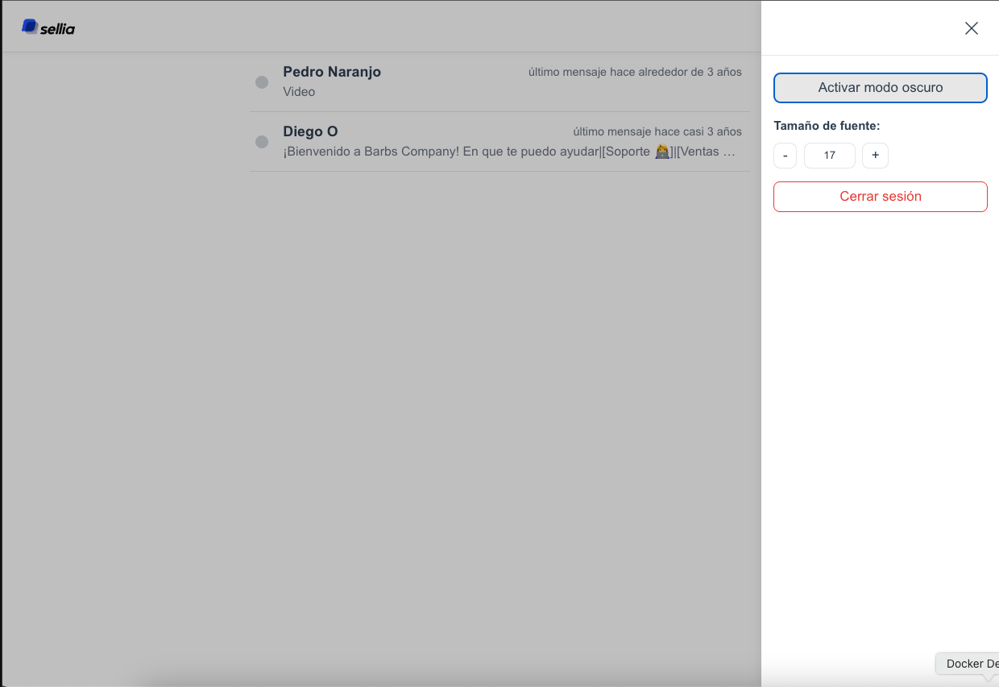
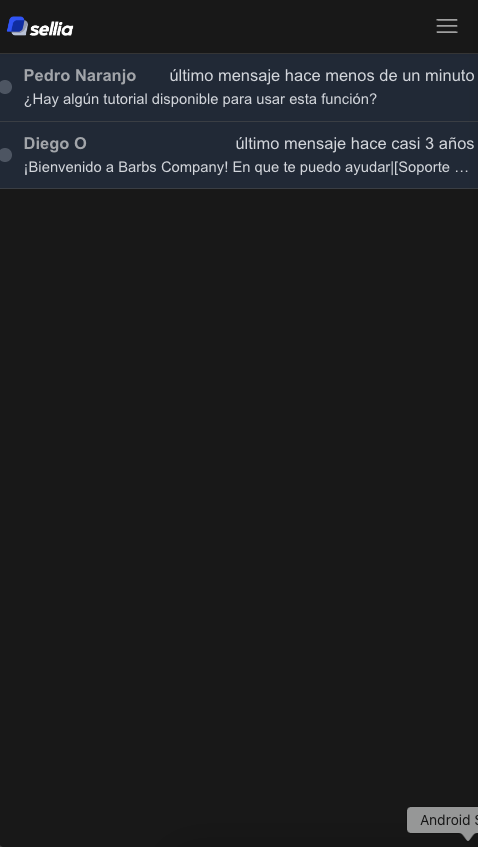
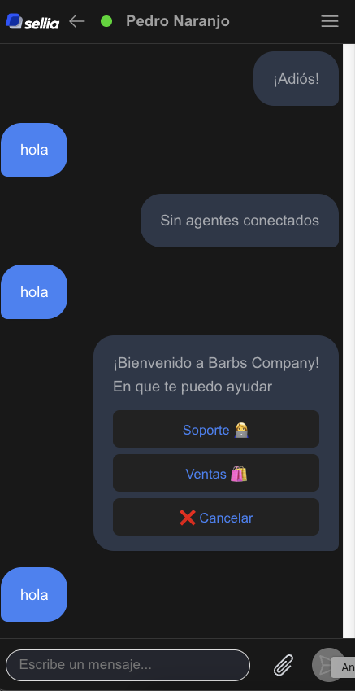
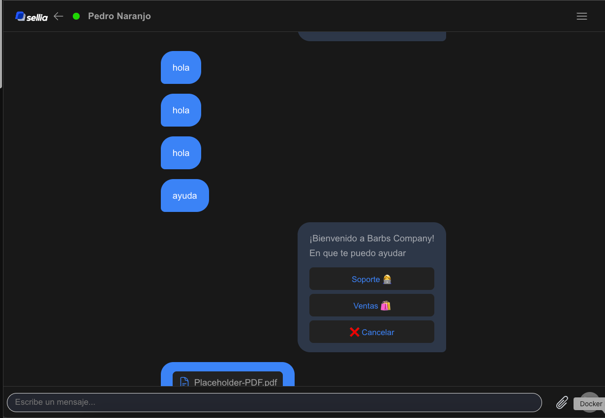
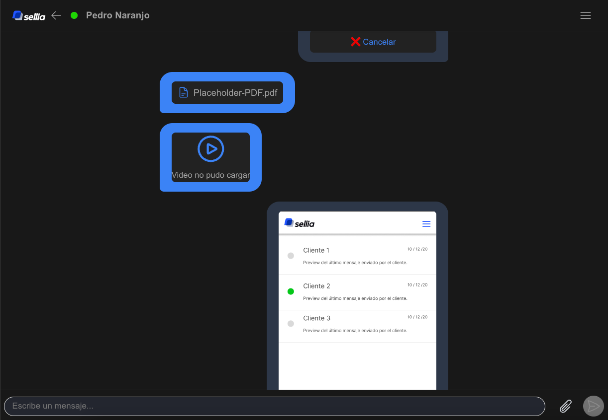
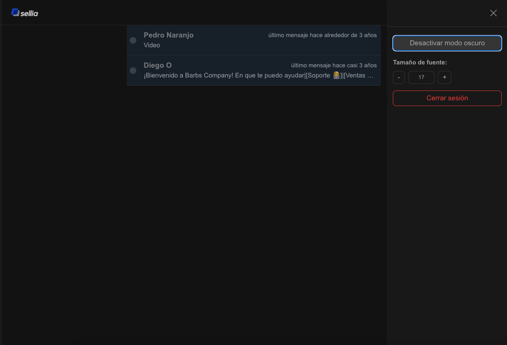

# Sellia Challenge


### Features
- Authentication
- Dark mode
- Font size control
- Responsive design
- List of conversations
    - Last message time
    - Last message preview
- Conversations View
    - Message list
    - Message input
    - Send button
    - Attach files of type image, video and docs.
    - Display image, video and docs in the message list.
    - Display parsed buttons in the message list.

### Screenshots









### Architectural Decisions

*   **Vue 3 Composition API**: Utilized for better code organization, reusability, and reactivity management.
*   **Vite**: Chosen as the build tool for its fast cold start times and instant hot module replacement.
*   **TypeScript**: Adopted for type safety, improved maintainability, and better developer experience.

### Design Patterns

*   **Service Pattern**: Services (e.g., `auth.ts`, `clients.ts`, `conversations.ts`) are used to encapsulate business logic and data fetching, promoting separation of concerns.
*   **Component-Based Architecture**: The UI is broken down into reusable components, following Vue's recommended practices.

### Libraries Used

*   **Vue Router**: For client-side routing.
*   **Pinia**: As the state management library, offering a simpler and more intuitive API compared to Vuex.
*   **date-fns**: For date manipulation and formatting.
*   **Heroicons**: For SVG icons.
*   **Vitest**: For unit testing.
*   **Sass**: For CSS pre-processing.

### Project Structure

*   `src/components`: Reusable UI components.
*   `src/services`: Business logic and API interactions.
*   `src/views`: Top-level components representing different pages/views.
*   `src/router`: Vue Router configuration.
*   `src/stores`: Pinia stores for state management.
*   `src/styles`: Global SCSS styles.
*   `tests`: Unit tests for components and services.

### Run Unit Tests with [Vitest](https://vitest.dev/)

```sh
npm run test:unit
```

### Deploy

Deployment is handled by GitHub Actions, we configured it in the .github/workflows/deploy.yml file.

First it builds the project, then it deploys it to GitHub Pages to the gh-pages branch.
Demo Available at: https://emipmttt.github.io/sellia-challenge/

### Design 
Design available at: https://www.figma.com/design/qrE6Q17Z1UfEli9yKJja5A/Sellia?node-id=0-1&t=7IsTNpVplV5VXMo6-1


## Project Setup

Follow these steps to get the project up and running locally:

### Install Dependencies

```sh
npm install
```

### Compile and Hot-Reload for Development

```sh
npm run dev
```

### Type-Check, Compile and Minify for Production

```sh
npm run build
```
